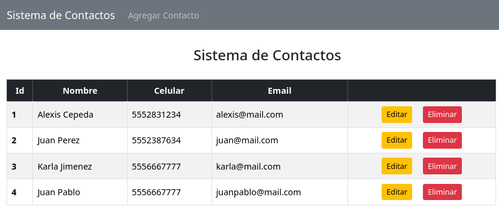

# Sistema de Gestión de Contactos

Proyecto CRUD desarrollado con Spring Boot (arquitectura **MVC**) para administrar contactos, permitiendo agregar, editar, visualizar y eliminar registros de forma sencilla.

## Tecnologías utilizadas

### Backend:
- **Spring Data JPA** para la capa de persistencia.
- **MySQL** como sistema de base de datos.
- **Spring Web** para el manejo de peticiones HTTP.
- **Lombok** para reducir la escritura de código repetitivo (getters, setters, constructores, etc.).
- **Maven** como gestor de dependencias.
- **Thymeleaf** como motor de plantillas para la generación de vistas dinámicas.

### Frontend
- **Thymeleaf** como motor de plantillas para la generación de vistas dinámicas. Estructurado en **fragmentos reutilizables** (cabecero, navegacion, pie-pagina) para facilitar el mantenimiento y reutilización del código.
- **Bootstrap** para agilizar la creación de componentes visuales y lograr una interfaz **responsive** y moderna.

## Interfaz gráfica

